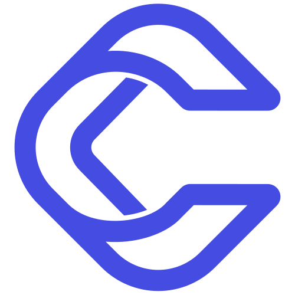

  <a href="https://github.com/KrisTheCanadian/soen-390">
  
    <h1 align="center">Protect CRYOTO | KPMG</h1>
  </a>

  
  
      

  
  
  
  
    
    </a>
    
    </a>

# Project Information 🚀

** Scalable Blockchain Based Employee Recognition Platform For KPMG **

## Team Members 💪 🎉

<table>
  <tr>
    <td align="center"><a href="https://github.com/kimdera"> <b>Kimiya Derakhshani</b></a></td>
    <td align="center"><a href="https://github.com/KrisTheCanadian"> <b>Kristopher Beauchemin</b></a></td>
    <td align="center"><a href="https://github.com/fadi-albasha"> <b>Fadi Albasha </b></a></td>
  </tr>
  <tr>
   <td align="center"><a href="https://github.com/gkillick"> <b>Graeme Killick</b></a></td>
   <td align="center"><a href="https://github.com/MilitsaB"> <b>Militsa Bogdeva</b></a></td>
<td align="center"><a href="https://github.com/martinsenecal"> <b>Martin Senecal</b></a></td>
  </tr>
  <tr>
<td align="center"><a href="https://github.com/samimerhi"> <b>Sami Merhi</b></a></td>
<td align="center"><a href="https://github.com/AhmadHashems"> <b>Ahmad Hashem</b></a></td>
    <td align="center"><a href="https://github.com/Alexialsousa"> <b>Alexia Sousa</b></a></td> 
  </tr>
</table>

## Introduction 📖

Employers are often looking to reward their employees and provide benefits, but the current reward systems are rudimentary. Right now, the only way to distribute kudos and rewards is when an employee recognizes another employee’s effort and work by sending online reward points mostly in internal or slack-integrated reward systems. There is no automatic distribution of points based on the completion of certain criteria and the user interface of some of these platforms isn’t modern and user-friendly.  

Our solution will be built through collaboration with KPMG as our product owners and our main goals are to create a modern rewards platform in which employees can interact with and be inspired by their colleagues' appreciation. 

The Cryoto rewards system will be used by internal KPMG employees and can be distributed to other companies in order to implement a modern user-friendly rewards system. Therefore potential target users are considered as all the company’s employees. Blockchain technology will be utilized to generate “KPMG Coins” and validate all transactions. Additionally, a marketplace will be created, allowing users to spend their “Coins” by purchasing gift cards and merchandise.

The purpose of this document is to showcase an overview of different processes that had to take place in order to create this web application, how the development cycles were managed and how each step of the project was implemented from requirements gathering, design and development to working on unit, system and integration testing and QA. The targeted audience of this document would be any member of the public that is interested to know more about this web application and how the project came to be. Our team has worked hard to implement effective document design enhancements that would help with the readability and usability of this document.

# High-Level Architecture Diagram 📊

# Application Screenshots
## Main Page

## Home Page

## Employee Search

## User Page

## Recognition

## Dark Mode

## Wallet

## Coin Transfer

## Settings

## Marketplace

## Settings

## Order Placement

## Order Summary

## Admin Dashboard

## License 📝

This repository is available under the [GNU GENERAL PUBLIC LICENSE](./LICENSE).
